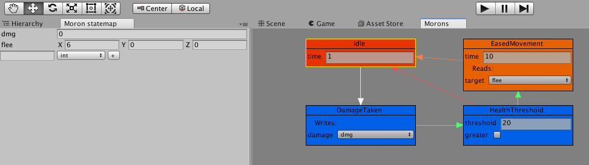
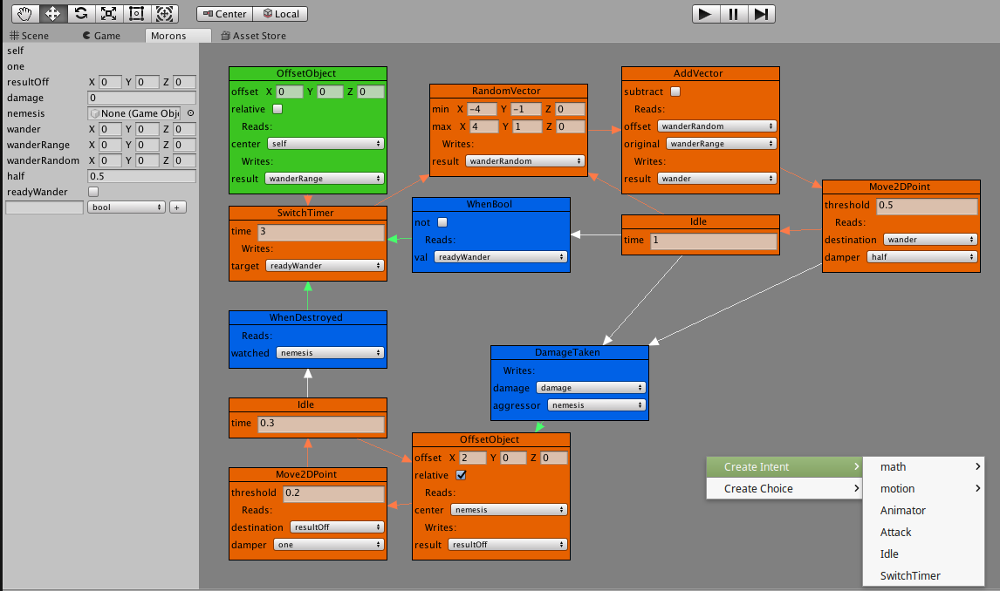

morons
====

This is a Unity package for visual editing of stateful AI graphs. 

It was built out of frustration with not being able to find any straightforward stateful-AI frameworks on the Unity store in early 2017. 
The author was working on a simple game, and wrote Morons to fill the gap that worked for the project at hand. While that game never materialized, and the author has outgrown Unity, the framework itself still works just fine, and represents work that the author committed to the project.

How does it work?
====

You, the creators, put a `MoronThinker` component onto any `GameObject`. It only has one property, a "graph". This graph is a regular asset that you create with the usual right-click menu. A thinker runs one graph, which dictates its behavior.

A graph is composed of two parts - the statemap and nodes. The statemap acts like a "working memory" for the thinker, holding variables that can be accessed when determining how it should act. The nodes (and the connections between them) dictate what the thinker actually does, and how it makes its decisions.

It's important to note that the library itself doesn't come with many types of nodes. It's a pretty barebones affair, it's expected that coders will define the nodes that are necessary for their game, and then any developer can create graphs that make sense.

Intents and Choices
====

There are two kinds of nodes, Intents and Choices. An Intent is something that controls the Thinker in some way - playing an animation, causing motion, triggering an ability, or even something as simple as a light being turned on or off.

Choices switch between Intents. A choice, when evaluated, returns either `true` or `false`. A Choice can only have maximum two edges leading away from it, one for a result of `true`, the other a result of `false`. When an Intent is done with its behavior, it goes through its list of Choices and determines which node should come next. Choices do not have to have a "false" branch, so multiple Choices can be evaluated at the end of any given Intent. If none of the Choices indicate a new Intent to be used, the original Intent will be run again, and the process repeats.

Examples
====

This simple graph idles until the thinker has received enough damage to flee - at which point it moves to a predefined point.

Orange nodes are Intents, blue nodes are Choices, the green node is the "root" (the first Intent to run), and the arrows between them dictate the flow of Choices.

A more complex example might help; 
this is an example of a monster from a simple 2D game. This monster wanders aimlessly around a given point until something damages it - at which point it chases down the object that damaged it and makes attacks until its aggressor is dead, then it repeats the wandering behavior.

Advanced
====

While the most obvious use for this system is various types of straightforward AI (like turrets, zombies, or simple monsters), the author found it to be just as useful for more environmental scripting. Crows that wait until someone approaches close enough before flying away, a chicken that follows the player around, or even just a simple automatic door that opens when something approaches it.

Finally, Intents can be marked as "interruptible", which means that they don't wait until completing before evaluating (and possibly using) the Choices attached to it. This makes it fairly easy to have behaviors that can be interrupted by things like taking damage, or a timer lapsing.

Future
====

This library has no future. The author wrote it for use in a Unity game that is now cancelled. The author has since outgrown Unity, and has no need of this kind of library anymore. But it works as intended, and the work the author put into it is something they're proud of (have you ever tried to write Unity editor gui windows and drawers?).

So while this isn't going anywhere, it's here for posterity, and is free to use.